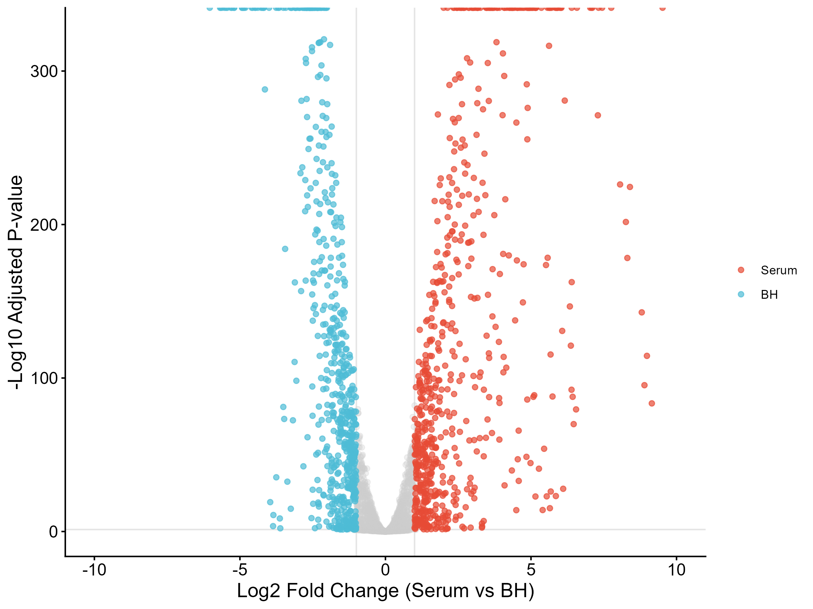
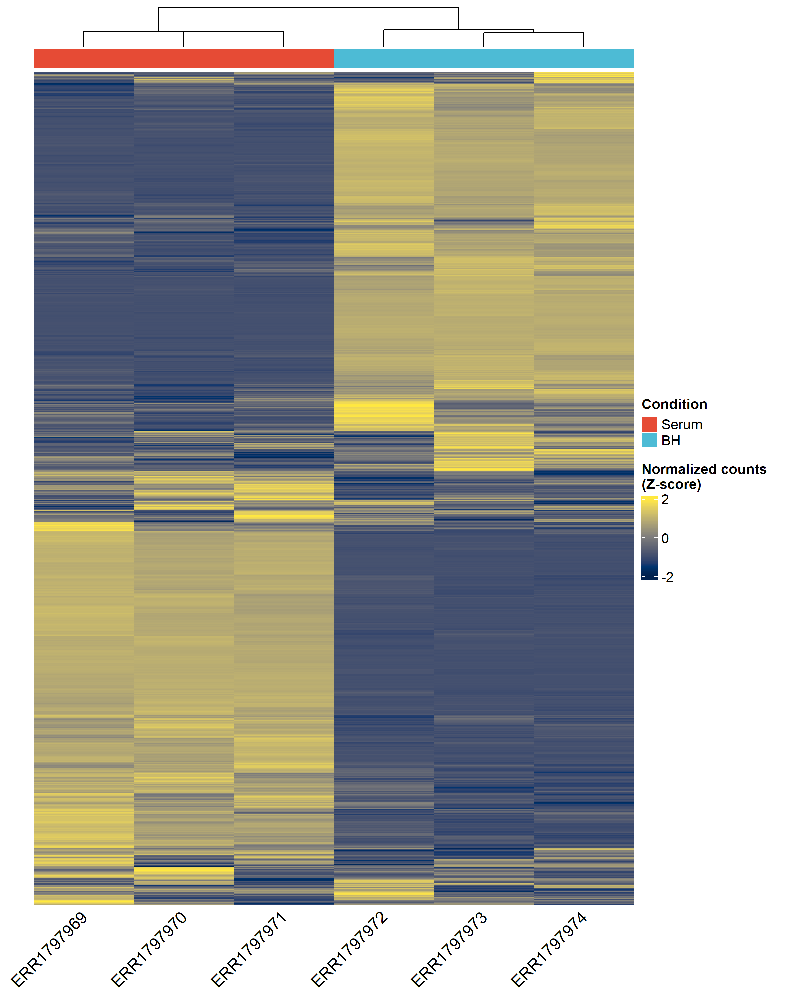
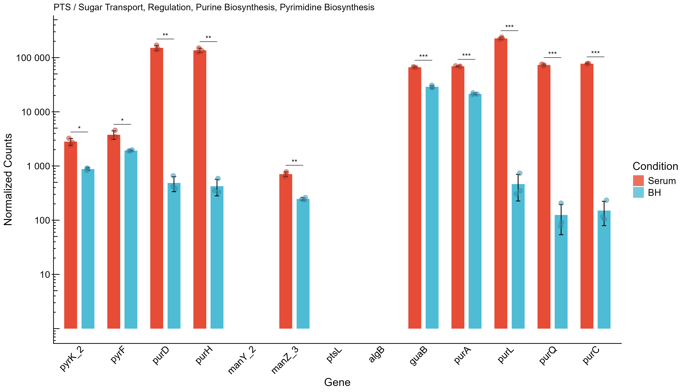
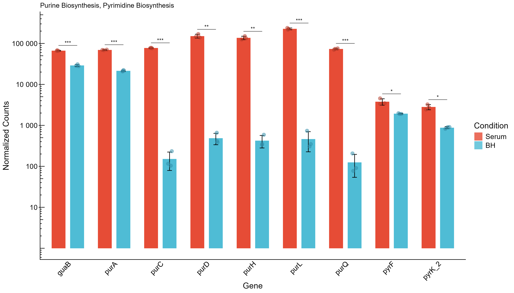
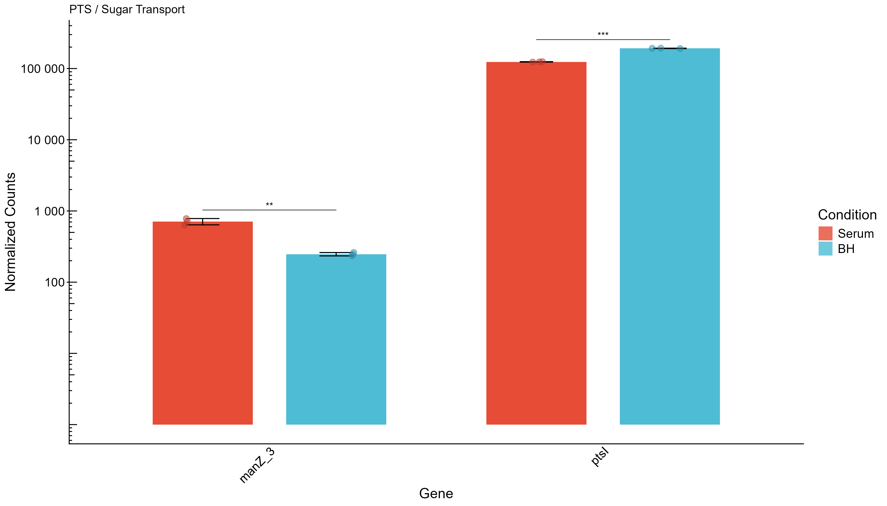
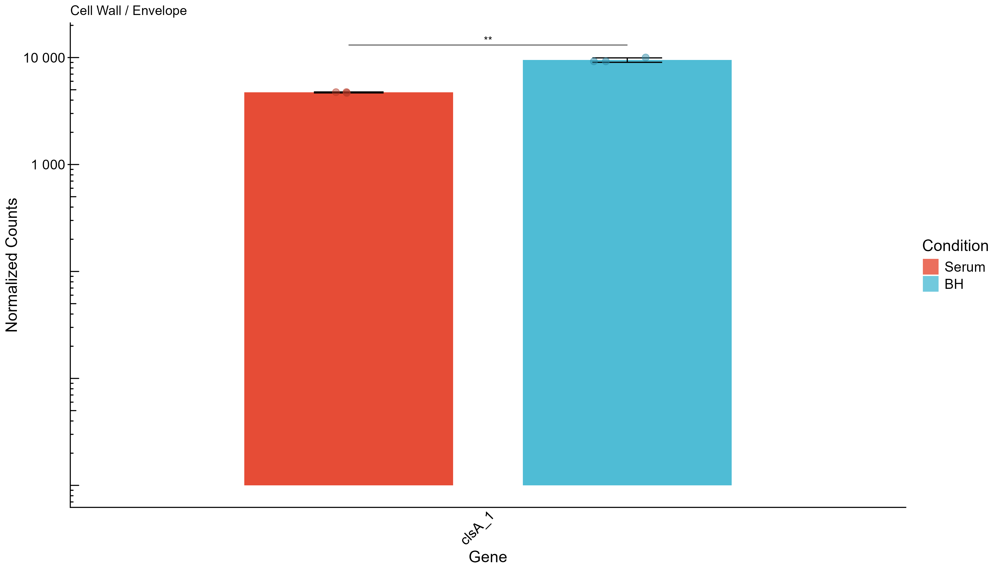

```{r}
#| label: setup
#| include: false
library(dplyr)
library(readr)
library(tidyr)
library(stringr)
library(tibble)
library(knitr)
```

# Overview

This report documents the genome analysis project for *Enterococcus faecium*.
The biological motivation is the study behind DOI 10.1186/s12864-017-4299-9,
which investigates fitness determinants during growth in human serum. The
project goal in the wiki is to identify genes in *E. faecium* that are relevant
for adaptation to human serum.

The current workspace contains a dual-assembly workflow, downstream evaluation,
annotation, synteny analysis, RNA-seq preprocessing/alignment, read counting,
and differential expression analysis.

## Paper and project focus

- Paper: RNA-seq and Tn-seq reveal fitness determinants of vancomycin-resistant *Enterococcus faecium* during growth in human serum
- DOI: 10.1186/s12864-017-4299-9
- Organism: vancomycin-resistant *E. faecium*
- Conditions: human serum versus rich medium (BHI/BH)

### Genes of interest from the paper

The report currently focuses on the genes of interest already used in the RNA
analysis:

- `manZ_3`, `manY_2`, `ptsL`, `algB`
- `guaB`, `purA`, `pyrF`, `pyrK_2`
- `purD`, `purH`, `purL`, `purQ`, `purC`
- `clsA_1`, `ddcP`, `ldt_fmp`, `mgs`, `lytA_2`

# Project plan versus completed work

```{r}
#| label: plan-vs-completed
plan_vs_completed <- tibble::tribble(
  ~Planned_item                        , ~Status     , ~Evidence                                             ,
  "PacBio assembly"                    , "Completed" , "Canu outputs and QUAST/BUSCO summaries present"      ,
  "Illumina + Nanopore assembly"       , "Completed" , "SPAdes outputs and summaries present"                ,
  "Assembly evaluation"                , "Completed" , "QUAST and BUSCO reports for both branches"           ,
  "Structural / functional annotation" , "Completed" , "Prokka outputs and GFF files present"                ,
  "Synteny comparison"                 , "Completed" , "MUMmerplot summaries for both branches"              ,
  "Read preprocessing"                 , "Completed" , "FastQC and trimming outputs in result/RNA_trim"      ,
  "RNA alignment to assemblies"        , "Completed" , "BWA + SAMtools alignment logs for Canu and SPAdes"   ,
  "Differential expression"            , "Completed" , "DESeq2 script and plots present"                     ,
  "Annotation refinement"              , "Not found" , "No dedicated refinement step identified"             ,
  "Plasmid identification"             , "Not found" , "No plasmid analysis outputs identified"              ,
  "SNP calling"                        , "Not found" , "No SNP calling outputs identified"                   ,
  "Antibiotic resistance evaluation"   , "Not found" , "No dedicated resistance analysis outputs identified" ,
  "Tn-seq / essential-gene analysis"   , "Not found" , "No Tn-seq analysis outputs identified"
)

kable(
  plan_vs_completed,
  caption = "Planned work versus what is currently present in the workspace."
)
```

The core analyses in the wiki plan are implemented. The extra analyses listed in
the course brief are not currently present in the workspace as dedicated output
or analysis scripts.

# Methods summary

The workflow is implemented as SLURM batch jobs with two assembly branches:

1. Canu long-read assembly from PacBio data.
2. SPAdes hybrid assembly from Illumina and Nanopore data.

Downstream analyses are run separately for each branch:

- QUAST and BUSCO evaluation
- Prokka annotation
- BLAST-based related species identification
- MUMmerplot synteny visualization
- RNA-seq trimming and QC
- RNA alignment with BWA and SAMtools
- HTSeq read counting
- DESeq2 differential expression analysis

## Current implementation status

- Workflow description and job structure are documented in the repository.
- Assembly and evaluation logs are present for both branches.
- RNA-seq preprocessing and alignment logs are present.
- A Canu-based differential-expression script produces the current figures.

# Results

## Assembly evaluation

```{r}
#| label: parse-assembly-metrics
genome_analysis_dir <- "C:/Programming/Projects/BioInf_Master/2026_VT/Genome_analysis/genome_analysis/"
parse_busco <- function(path, branch, assembly) {
  lines <- read_lines(path)
  summary_line <- lines[str_detect(lines, "^\t*C:")][1]
  stats <- lines[str_detect(
    lines,
    "^\t*[0-9]+\t(Number of scaffolds|Number of contigs|Total length|Percent gaps|Scaffold N50|Contigs N50)"
  )]

  tibble(
    Branch = branch,
    Assembly = assembly,
    Complete_buscos = str_match(summary_line, "C:(\\d+\\.\\d+)%")[, 2],
    Single_copy = str_match(summary_line, "S:(\\d+\\.\\d+)%")[, 2],
    Duplicated = str_match(summary_line, "D:(\\d+\\.\\d+)%")[, 2],
    Fragmented = str_match(summary_line, "F:(\\d+\\.\\d+)%")[, 2],
    Missing = str_match(summary_line, "M:(\\d+\\.\\d+)%")[, 2],
    Total_length_bp = str_extract(
      stats[str_detect(stats, "Total length")],
      "^\\s*(\\d+)"
    ),
    N50 = str_extract(
      stats[str_detect(stats, "Scaffold N50|Contigs N50")],
      "\\d+$"
    )
  )
}

parse_quast <- function(path, branch, assembly) {
  lines <- read_lines(path)
  q_line <- lines[str_detect(lines, "N50 =")][1]

  tibble(
    Branch = branch,
    Assembly = assembly,
    N50_bp = str_match(q_line, "N50 = ([0-9]+)")[, 2],
    L50 = str_match(q_line, "L50 = ([0-9]+)")[, 2],
    auN = str_match(q_line, "auN = ([0-9.]+)")[, 2],
    Total_length_bp = str_match(q_line, "Total length = ([0-9]+)")[, 2],
    GC_percent = str_match(q_line, "GC % = ([0-9.]+)")[, 2],
    Ns_per_100kbp = str_match(q_line, "# N's per 100 kbp =\\s*([0-9.]+)")[, 2]
  )
}

assembly_eval <- bind_rows(
  parse_busco(
    paste0(genome_analysis_dir, "result/busco_canu_report_specific.txt"),
    "Canu",
    "PacBio"
  ),
  parse_busco(
    paste0(
      genome_analysis_dir,
      "result/short_summary.specific.enterococcaceae_odb12.E_faecium_SPAdes_20260415_121016.txt"
    ),
    "SPAdes",
    "Illumina + Nanopore"
  )
) |>
  left_join(
    bind_rows(
      parse_quast(
        paste0(
          genome_analysis_dir,
          "output_slurm/quast_Canu_slurm-4904463.out"
        ),
        "Canu",
        "PacBio"
      ),
      parse_quast(
        paste0(
          genome_analysis_dir,
          "output_slurm/quast_SPAdes_slurm-4904464.out"
        ),
        "SPAdes",
        "Illumina + Nanopore"
      )
    ),
    by = c("Branch", "Assembly")
  )

kable(
  assembly_eval,
  caption = "Assembly evaluation summary from BUSCO and QUAST outputs."
)
```

The Canu assembly is much more contiguous than the SPAdes assembly. BUSCO is
slightly better for SPAdes in completeness, but QUAST shows a large gap in
contiguity and many more ambiguous bases in the hybrid assembly.

## Synteny and closest species

```{r}
#| label: synteny-summary
read_synteny <- function(path, branch) {
  read_lines(path) |>
    str_trim() |>
    purrr::discard(~ .x == "") |>
    str_split_fixed("\\\\t|\t", 2) |>
    as_tibble(.name_repair = "minimal") |>
    setNames(c("key", "value")) |>
    pivot_wider(names_from = key, values_from = value) |>
    mutate(Branch = branch, .before = 1)
}

synteny_summary <- bind_rows(
  read_synteny(
    paste0(
      genome_analysis_dir,
      "result/04_genomeSynteny/mummerplot_canu/E_faecium_PacBio_20260415_114224/E_faecium_PacBio_20260415_114224_synteny_summary.tsv"
    ),
    "Canu"
  ),
  read_synteny(
    paste0(
      genome_analysis_dir,
      "result/04_genomeSynteny/mummerplot_spades/E_faecium_SPAdes_20260415_121016/E_faecium_SPAdes_20260415_121016_synteny_summary.tsv"
    ),
    "SPAdes"
  )
)

kable(
  synteny_summary,
  caption = "Synteny summary tables for both assembly branches."
)
```

Both assemblies identify *Enterococcus faecium* as the closest species.

## RNA-seq preprocessing and alignment

The repository contains FastQC reports for pre- and post-trim RNA reads in
[result/RNA_trim](result/RNA_trim).
Alignment logs show BWA mapping against both assembly branches using the trimmed
Serum and BH paired reads.

One preprocessing log reports missing paired FASTQ files in a specific run
directory, so the RNA workflow should be reviewed for path consistency before
final submission.

## Differential expression analysis

The current differential-expression script uses DESeq2 and produces:

- a volcano plot
- a heatmap of normalized counts
- barplots for genes of interest with significance markers













The script currently operates on the Canu-derived read counts and focuses on the
gene set defined from the paper.

# Documentation and evaluation

The student manual requires the GitHub repository and wiki to function as a
clear, organized, reproducible project record. The required content includes:

- the paper being worked on
- the project plan
- goals and hypotheses
- one section per analysis step
- methods, results, and short discussion for each analysis
- general thoughts and interpretation
- preferably a daily log

## Current repository status

- Code and workflow scripts are saved in the repository.
- The wiki already contains the project overview and plan.
- Analysis outputs are saved under `result/`.
- A Quarto report draft now exists as the main written summary.

## Remaining gaps

- Expand the wiki into per-analysis pages if that is not already done.
- Add a daily log if the course expects one explicitly.
- Integrate the student-manual GitHub and evaluation guidance more directly once
  the page excerpts are added.

# References

1. Zhang et al. 2017. RNA-seq and Tn-seq reveal fitness determinants of vancomycin-resistant *Enterococcus faecium* during growth in human serum. DOI: 10.1186/s12864-017-4299-9.
